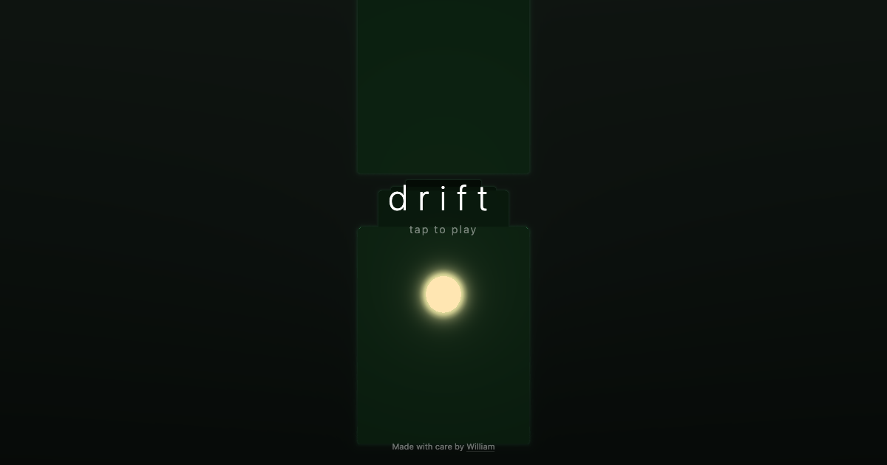

# Drift

A raymarched 3D game in a single HTML file. Zero dependencies. Under 200 lines.

Flappy Bird's tap-to-fly mechanic, reimagined as a glowing orb drifting through an abstract void. The difficulty ramps so smoothly you won't notice until it's too late.

## Play

Open `drift.html` in any modern browser. That's it.

## Tech

- **Rendering:** Fullscreen fragment shader with raymarched signed distance functions (SDFs)
- **3D:** Camera, orb, and pillars defined mathematically — no meshes, no models, no 3D library
- **Audio:** Web Audio API synthesis — ambient drone, tap feedback, death sound
- **Score:** localStorage persistence

The entire game — HTML, CSS, JavaScript, GLSL — lives in one file.

## Deploy

Put `drift.html` on any static host. No build step required.

---

Made with care by [William](https://william.revah.paris)
